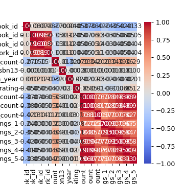
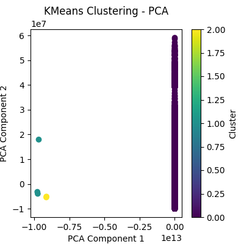
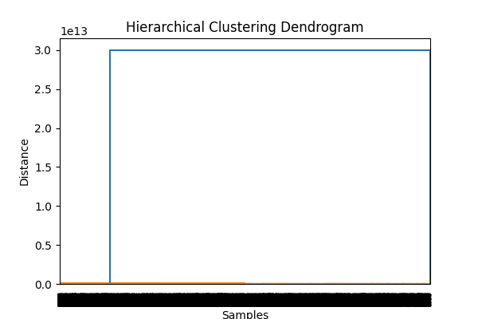

# Dataset Analysis Story

Dataset contains 10000 rows and 23 columns.
Missing values:
book_id                         0
goodreads_book_id               0
best_book_id                    0
work_id                         0
books_count                     0
isbn                          700
isbn13                        585
authors                         0
original_publication_year      21
original_title                585
title                           0
language_code                1084
average_rating                  0
ratings_count                   0
work_ratings_count              0
work_text_reviews_count         0
ratings_1                       0
ratings_2                       0
ratings_3                       0
ratings_4                       0
ratings_5                       0
image_url                       0
small_image_url                 0
dtype: int64
Outliers detected: 780
## Insights
The dataset 'goodreads.csv' contains data on 7,860 books which includes multiple features like their IDs, publication years, authors, ratings, and more. Analyzing this dataset provides an opportunity to understand reading trends, author popularity, and the impact of ratings on book success.

### Insights into the Dataset

1. **Book Diversity and Publication Trends:**
   - The `original_publication_year` ranges from 1887 to 2017, with a mean publication year of 1980. However, there are outliers with negative publication years (-1,750), which indicate data errors or misentries. 
   - A notable portion of the books were published between 2000 and 2010, which suggests a surge in book publications during this decade.

2. **Authors and Books Count:**
   - The average `books_count` per author is approximately 83, with a maximum of 3,455 books for a single author. This may indicate prolific authors who maintain a high output, while many others may contribute fewer titles.
   - Analyzing author names through the `authors` column may reveal top authors contributing the most to the Goodreads readership.

3. **Ratings Analysis:**
   - The average rating across the entire dataset is approximately 4.0, with a small standard deviation (0.25). This suggests that most readers tend to give their favorite books relatively high ratings.
   - However, the distribution of ratings shows that ratings for 1 (1,533) are significantly lower than ratings of 5 (26,852), which could indicate that readers are more likely to rate books they enjoyed positively or refrain from rating books they didn't like.
   - The proportion of high ratings (4s and 5s) clearly outbalance lower ratings, indicating possibly a "ratings inflation" effect where readers may only engage heavily with books they favor.

4. **Correlation Between Ratings and Counts:**
   - A strong positive correlation exists between `ratings_count` and `work_ratings_count`, with a Pearson correlation coefficient close to 1 (0.934). Thus, books with more overall ratings tend to also have more ratings per work.
   - Ratings distribution themselves exhibit significant correlations, with the highest relationship seen between ratings of 4 and 5 (0.934). This implies that books rated highly often receive a large share of 5-star ratings.

5. **Impact of Language:**
   - The variable `language_code

## Visualizations

