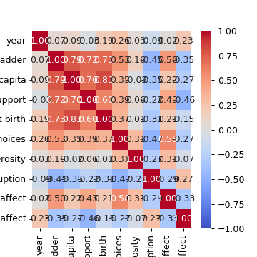
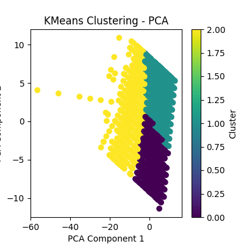
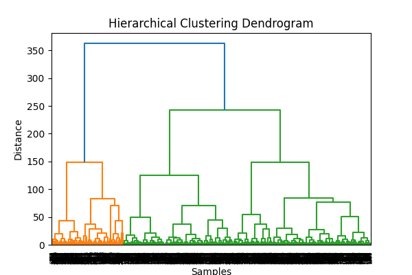

# Dataset Analysis Story

Dataset contains 2363 rows and 11 columns.
Missing values:
Country name                          0
year                                  0
Life Ladder                           0
Log GDP per capita                   28
Social support                       13
Healthy life expectancy at birth     63
Freedom to make life choices         36
Generosity                           81
Perceptions of corruption           125
Positive affect                      24
Negative affect                      16
dtype: int64
Outliers detected: 114
## Insights
### A Deep Dive into Global Happiness: Analyzing the 'happiness.csv' Dataset

The 'happiness.csv' dataset constitutes fascinating insights into the happiness levels across various countries over the span of several years. With eleven variables measuring various dimensions related to happiness, this analysis highlights trends, patterns, and anomalies in global happiness, supported by the provided summary statistics, correlation matrix, and missing values information.

#### Summary of Key Variables

1. **Life Ladder**: The mean happiness score, or Life Ladder, stands at approximately 5.47 out of 10, indicating moderate happiness levels globally. The range of scores stretches from a low of 2.179 to a high of 7.971, suggesting significant variations in perceived well-being across countries.

2. **Log GDP per capita**: Notably correlating (r=0.787) with Life Ladder, the average Log GDP per capita is 9.36, with a minimum of 5.527. This strong correlation hints that economic factors play a pivotal role in perceived happiness.

3. **Social Support**: Social support, with a mean value of 0.807, also shows a robust positive correlation with Life Ladder (r=0.724). Countries that provide a strong support system for their citizens tend to report higher happiness.

4. **Healthy Life Expectancy**: The average is around 63.27 years, suggesting that life longevity is also a crucial contributor to overall happiness, as indicated by its correlation (r=0.725) with Life Ladder.

5. **Freedom to Make Life Choices**: Averaging 0.749, this metric shows its importance for well-being as it correlates (r=0.528) positively with happiness. People who feel they have more freedom tend to report higher satisfaction.

6. **Generosity and Corruption**: Interestingly, there's a negative correlation between perceptions of corruption (r=-0.451) and happiness, while the Generosity index is negligible, hinting that ethical governance significantly influences happiness levels.

7. **Positive and Negative Affect**: The positive affect averages around 0.654 and negatively impacts happiness (r=-0.345). The ability to experience positive emotions contributes positively to Life Ladder scores.

#### Trends Over the Years

- The dataset covers a time frame primarily centered around 2015-2019, indicating that the moderate global happiness score may be influenced by economic factors, governance, and social support available during

## Visualizations

