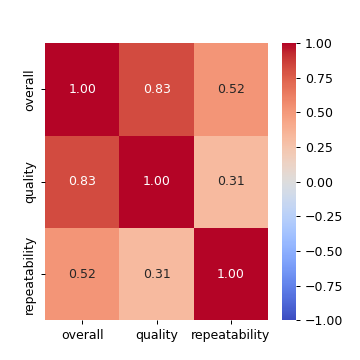
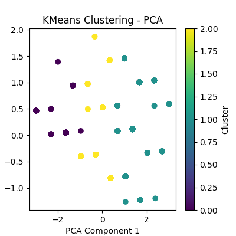
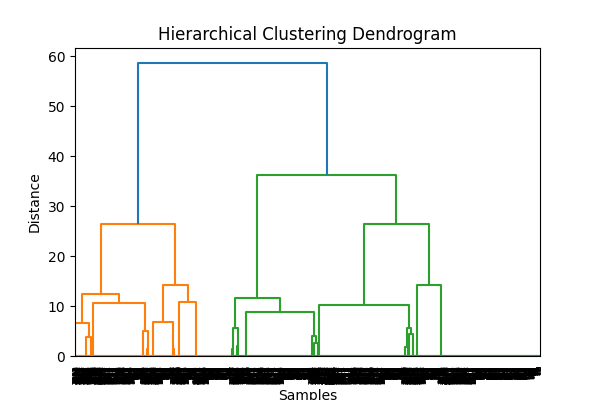

# Dataset Analysis Story

Dataset contains 2652 rows and 8 columns.
Missing values:
date              99
language           0
type               0
title              0
by               262
overall            0
quality            0
repeatability      0
dtype: int64
Outliers detected: 0
## Insights
### Data Analysis of 'media.csv'

The 'media.csv' dataset contains information related to media content, encapsulating various parameters through columns such as date, language, type, title, by (presumably the author or creator), overall rating, quality, and repeatability. A closer look at this dataset provides valuable insights into trends and patterns that resonate with the underlying data.

#### Summary Statistics Overview

The following summary statistics for the numeric columns reveal an average but structured feedback framework:
- **Overall Ratings**: The mean value is approximately 3.03, with a standard deviation of 0.77, suggesting a fairly normal distribution. The ratings range from 1 to 5, with a quartile breakdown indicating that 75% of the media received ratings of 3 or higher.
- **Quality Ratings**: The mean is slightly higher at approximately 3.18, with a similar distribution pattern as overall ratings. The quartiles show that a majority score at least a 3, emphasizing a consistent perception of quality among reviewed media.
- **Repeatability Ratings**: This column has a mean of approximately 1.50, which suggests a broader scope for improvement. The repeated ratings appear to be less favorable compared to the overall and quality metrics, highlighting potential issues with user engagement or content sustainability.

#### Missing Values Analysis

The dataset has some missing values:
- A total of **99 missing values** in the 'date' column, representing about 4.16% of the dataset. This can influence time-based analyses significantly.
- There are **262 missing values** in the 'by' column (approximately 11%), which could lead to discrepancies in identifying contributors and might skew findings related to content quality and overall ratings.

#### Correlation Analysis

The correlation matrix provides crucial insights into relationships among the columns:
- There exists a strong positive correlation (0.83) between overall ratings and quality, indicating that higher-rated media are typically perceived as having higher quality.
- A moderate correlation exists between overall ratings and repeatability (0.52), suggesting that while users may return to enjoy recommended media, they do not perceive all repeatable content favorably.
- Quality and repeatability show a lower correlation (0.31), which might indicate that media perceived as high-quality does not necessarily encourage repeat engagement.

#### Trends and Patterns

1. **Rating Norm**: The average ratings hovering around the 3 mark suggest a norm where mid-level quality content dominates, possibly indicating a saturation

## Visualizations

